# Ethan Lucas Project 5

## Project Overview

- This project was intended to learn how to setup a CICD pipeline.
- Tools used were github actions, webhooks, docker, dockerhub, repository secrets, AWS, cf-templates.

```mermaid
graph TD
    A[Dev pushes tag to github] --> B[Github actions workflow triggers]
    B --> C[Builds docker image]
    C --> D[Pushes new image to dockerhub]
    D --> E[Github webhook triggers]
    E --> F[Payload sent to EC2 listener]
    F --> G[Bashscript executes]
    G --> H[Remove old container]
    G --> I[Pull new container]
    G --> J[Start/Run new container serving updated web content]

    
    style A fill:#8A564C,stroke:#333,stroke-width:2px
    style B fill:#8A564C,stroke:#333,stroke-width:2px
    style C fill:#8A564C,stroke:#333,stroke-width:2px
    style D fill:#8A564C,stroke:#333,stroke-width:2px
    style E fill:#8A564C,stroke:#333,stroke-width:2px
    style F fill:#8A564C,stroke:#333,stroke-width:2px
    style G fill:#8A564C,stroke:#333,stroke-width:2px
    style H fill:#7A3636,stroke:#333,stroke-width:2px
    style I fill:#E89215,stroke:#333,stroke-width:2px
    style J fill:#24381A,stroke:#333,stroke-width:2px
```

## Instance Details

- AMI is Ubuntu`id = "ami-0ecb62995f68bb549"`
    - Instance type = t2.medium
    - Recommended volume size = 30gb
    - SG should allow ssh traffic from WSU and home ip. (so only ourselves can ssh into the instance)
    - SG should allow http from all ips. (so people can access our web content)
    - SG should allow traffic on port 9000 for all ips (for webhook, we are using secrets for validation)

## Docker Setup / Testing on EC2 Instance / Bashscript
- To install docker in ubuntu run: `apt-get install -y docker.io` `systemctl enable docker` `systemctl start docker`
    - To confirm installation, do `sudo systemctl status docker`. It should tell you whether the service is running or not.
- How to pull an image from dockerhub repo.
    - Ex. `docker pull ethluc/docker-site:latest` then `docker run -d -p 80:80 --restart always ethluc/docker-site:latest` Head over to http://(EIP) and see if it serves your web content
        - You should run with the -it flag if you need to interactively use your container and the -d (detached mode) otherwise so it doesn't block your terminal
- Bashscript
    - Our bashscript stops our old container, remove our old container, pulls the new and updated container, then runs the new container to serve our web content.
    - How to test if the script is working: Push a new tag to the repository to trigger a workflow and then check if the docker image is new on the instance by running `docker ps -a`. Alternatively if you made changes to the web content itself you can check at the website's ip.
    - Link: [BashScript](https://github.com/WSU-kduncan/cicdf25-EthLuc/blob/main/deployment/bashscript.sh)

## Configuring Webhook listener
- To install webhook to the EC2 instance do `sudo apt-get install webhook` then `sudo systemctl start webhook`
    - To verify do `sudo systemctl status webhook` and see if the service is running.
- Our webhook definition file runs our bashscript assuming that it is triggered. It is triggered by github sending a payload with our secret token.
    - To verify the definition file was loaded by webhook do `sudo systemctl status webhook`. You should see something like `loaded 1 hook` and the hook name.
    - To check that the webhook is receiving payloads that trigger it, do `sudo journalctl -u webhook -f` and you can monitor the logs in real time. Then try sending a payload to trigger the webhook and see if it works.
    - Link: [Definition File](https://github.com/WSU-kduncan/cicdf25-EthLuc/blob/main/deployment/hooks.json)
- Our webhook service file only starts after the network is up and runs the service as an ubuntu user. The `ExecStart` part is the command starting our service.
    - To enable and start the webhook service do, `sudo systemctl enable webhook.service` and `sudo systemctl start webhook.service`
    - To check if the service is properly running and trigger our bashscript on payload do `sudo journalctl -u webhook.service -f`. Then send a payload and see if it is triggering properly.

## Configuring a Payload Sender
- I chose github because it gives me more options on when the webhook should be triggered (right now its on workflow)
- To enable github to send payloads to our EC2 listener
    - Go to your repo > settings > webhooks > then put in your payload url Ex. `http://98.80.53.97:9000/hooks/deploy` The deploy part is the id of your hook > Change content type to json > Add a secret (recommended) > Select individual events > Choose desired events
    - Our current setup is that only a tag being pushed to the repository will send a payload to the EC2 listener.
    - To verify a successful payload delivery simply push a tag while running `sudo journalctl -u webhook.service -f` and see if the webhook was successful. 
    - Our webhook will only trigger when github send a payload since it only triggers on payloads signed using HMAC-SHA1 (github's signature) and with our secret.

## Resources
- Website is from project 3 and was created using chatGPT with the prompt `"Create me a website using two html files (one being an index) and one css file. The website is about how Path of Exile (1) is the best arpg of all time and is heavily inspired from Diablo 2."`.
- [Adnanh's Webhook](https://github.com/adnanh/webhook) Used a lot of stuff in this like a "template" and edited it afterwards to fit what I needed.
- [LevelUpCoding](https://levelup.gitconnected.com/automated-deployment-using-docker-github-actions-and-webhooks-54018fc12e32?gi=f0723d945508) Used this to help me understand how to make github actions work alongside webhooks (and also setting up webhooks in general)