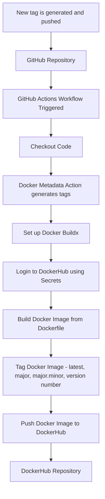

# Ethan Lucas Project 4

### Continuous Integration Project Overview
- The goal of this project was to learn about how to use github actions/workflow to automate continuous integration for our website app.
- The tool used in this project are:
    - Github actions
    - Docker
    - Dockerhub
    - Repository Secrets

## Diagram

### Part 1: Docker File & Building Images

- The website in "web-content" was created by chatGPT using this prompt: `"Create me a website using two html files (one being an index) and one css file. The website is about how Path of Exile (1) is the best arpg of all time and is heavily inspired from Diablo 2."`
    - You can view the content at: `http://(ip given by AWS)/index.html`
    - Web-content is located in my repo at: `https://github.com/WSU-kduncan/cicdf25-EthLuc/tree/main/web-content`
- Our Dockerfile copies all website content in `web-content` and using apache's httpd2.4 image, creates a container that hosts our website on port 80.
    - The Dockerfile in my repo is located at: `https://github.com/WSU-kduncan/cicdf25-EthLuc/blob/main/web-content/DockerFile`
- How to build the container
    - In your terminal type `docker build -t (dockerhub username)/(desired image name):(tag) ./web-content`
    - To make more tags `docker tag (dockerhub username)/(desired image name):1.0.0` The 1.0.0 is a tag example.
        - Then push your new tags `docker push (dockerhub username)/(desired image name):(tag)`
- How to run the container
    - Once you have the image built, type in your terminal `docker run -d -p 8080:80 (dockerhub username)/(chosen image name):(tag)`

### Part 2: Github Actions & DockerHub
- Configuring Github Repo Secrets
    - To create a PAT or Private Access Token (for dockerhub), login to dockerhub's website and go into your account settings.
        - Then go down to `Personal access tokens` > `Generate new tokens`.
        - Give your token a name and set its permissions, for this project it is recommended to set them to Read/Write.
    - Setting up Secrets / Making Secrets
        - Go to your repository then `Settings` > `Secrets and Variables` > `Actions` > `New Repository Secret`.
        - The secrets for this project are for logging into dockerhub. One secret is for our username, `DOCKER_USERNAME`, and the other is for our PAT, `DOCKER_TOKEN`.
- CI with Github Actions
    - Our workflow triggers on any push to main
    - Whenever a push to main happens, the steps are: check out the repo, setup docker buildx, login to dockerhub using secrets, build the docker image, push to dockerhub
        - Link to workflow file in my repo `https://github.com/WSU-kduncan/cicdf25-EthLuc/blob/main/.github/workflows/main.yml`
- Testing and Validating
    - To test if the workflow is working, do any commit and push to main. Head over to the repository and there now should be either a yellow circle, green checkmark or red x. The yellow circle indicates the workflow is still ongoing (wait a bit), the green checkmark indicates that it worked and had no issues, the red X indicates that something went wrong.
        - If red X, click the red X and see where the workflow failed. Fix the issues and then try another commit and push to main to check if it is working.
        - If green checkmark, check your dockerhub repo to make sure that the image was pushed to the dockerhub repo.
            - To be extra sure you can pull your docker image from your repository and see if it is serving your web site content correctly.
    - Link to dockerhub repo `https://hub.docker.com/repository/docker/ethluc/docker-site`

### Part 3: Semantic Versioning
- Generating tags
    - You can see tags in a git repo by looking at the "tags" button just slightly below the repository name. After clicking on that you can see all tags created.
    - To generate a tag, type `git tag -a v*.*.*` you can also add at the end `-m "annotation"` to annotate your tags to make them easier to follow/remember what they were for.
    - To push a tag, type `git push origin v*.*.*`
- Semantic Versioning Container Images with Github Actions
    - Our workflow will trigger on a new tag.
    - Whenever a new tag is made, the steps are: check out the repo, generate metadeta, setup docker buildx, login to dockerhub using secrets, build the docker image, push the image with the tags `latest, major, major.minor, major.minor.patch`
    - What to update to use this in a different repo.
        - In the metadata section change the images: to `your dockerhub username/your image`
        - In the build/push image section, you may need to change the context: and file: if your dockerfile isn't located in the same place with the same name.
        - Your repo needs to have the DOCKER_USERNAME and DOCKER_TOKEN secrets. You don't need to change these in the workflow file, but you will need to make sure your repo has these secrets with your own information.
    - My workflow file in my repo: `https://github.com/WSU-kduncan/cicdf25-EthLuc/blob/main/.github/workflows/main.yml`
- Testing and Validating
    - To test if the workflow is working, generate and push a new tag. If confused go back up to the "generating tags" section for help.
        - Head over to your github repo and check if the workflow completed successfully. If it did go to your dockerhub repo to check if the correct semantic versioning tags were made.
    - To verify that the image is working from dockerhub, pull the image and run the container. Then check if it is serving your website content correctly by going to `http://localhost:8080/` If you see the website then the container is working correctly.
    - Link to my dockerhub repo with tags: `https://hub.docker.com/repository/docker/ethluc/docker-site/general`

### Resources
- Website is from project 3 and was created using chatGPT with the prompt `"Create me a website using two html files (one being an index) and one css file. The website is about how Path of Exile (1) is the best arpg of all time and is heavily inspired from Diablo 2."`.
- `https://github.com/marketplace/actions/build-and-push-docker-images` Used this to help me understand how to setup my workflow to build and push images
- `https://docs.docker.com/build/ci/github-actions/manage-tags-labels/` Used this to help me figure out how to change my workflow to work with tags only.
- `https://semver.org/` Used to help understand semantic versioning.

